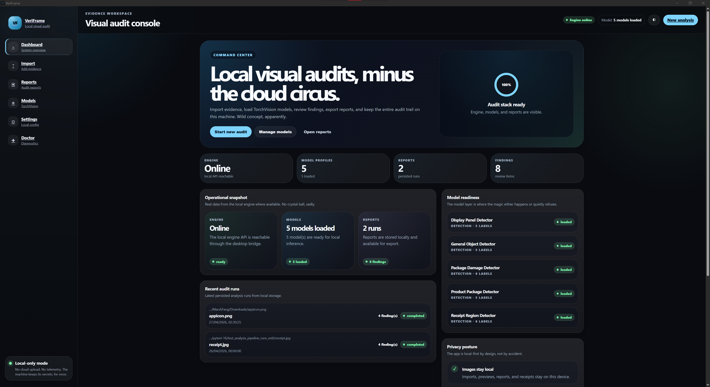
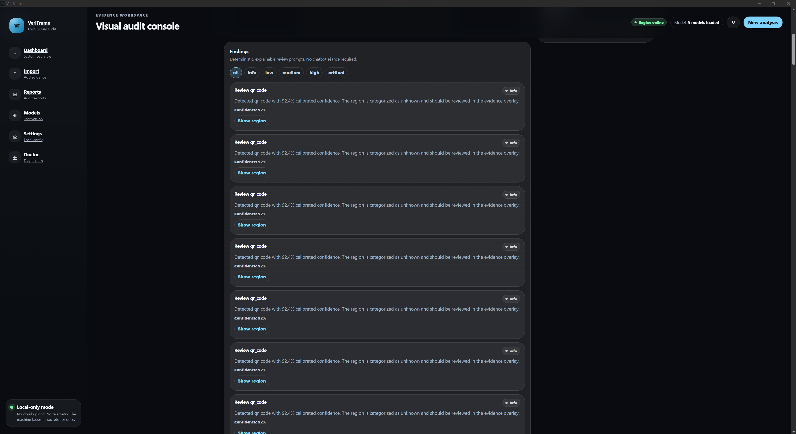
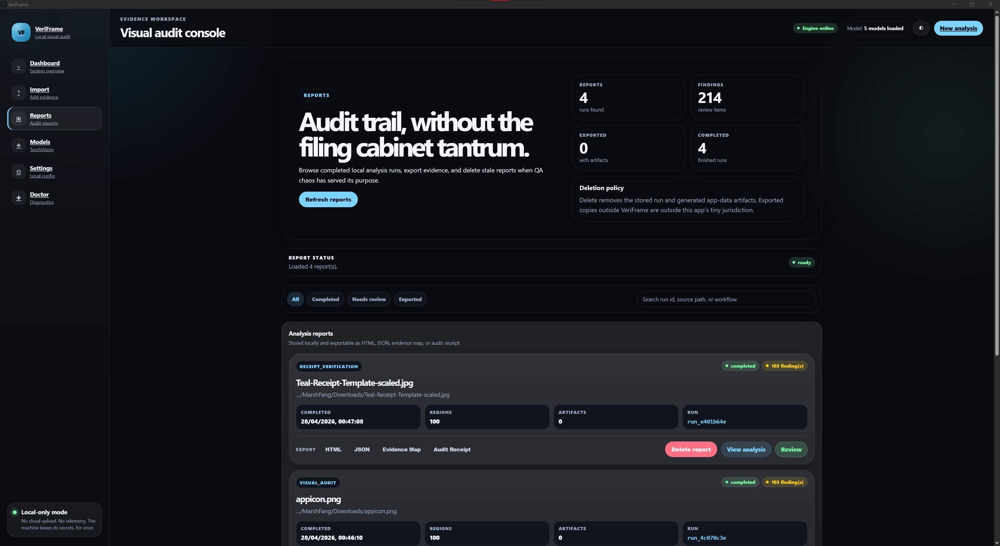
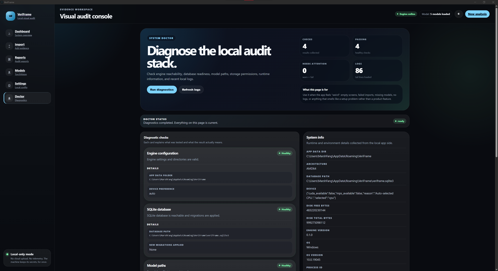

<h1 align="center">VeriFrame</h1>

<p align="center">
  <b>Local-first visual evidence engine for images that need more than a vibe check.</b><br/>
  On-device computer vision, explainable findings, reviewable reports, and audit receipts.
</p>

<p align="center">
  
  
  
  
  
  
  
</p>

<p align="center">
  <a href="#-what-is-veriframe">Overview</a> ·
  <a href="#-screenshots">Screenshots</a> ·
  <a href="#-what-it-does">Capabilities</a> ·
  <a href="#-architecture">Architecture</a> ·
  <a href="#-quick-start">Quick Start</a> ·
  <a href="#-packaging">Packaging</a> ·
  <a href="#-research-motivation">Research</a>
</p>

---

## 🧭 What Is VeriFrame?

**VeriFrame** is a desktop visual audit system that turns real-world images into structured, explainable evidence.

It is built for cases where an image is not just an image. It is proof, context, a record, a claim, a receipt, a damaged package, a device display, a screenshot, or a tiny rectangle of chaos that someone will eventually ask you to justify.

VeriFrame takes a user-selected image and creates a local analysis record with:

- image metadata and SHA-256 fingerprints
- quality checks before analysis
- detected regions and evidence maps
- model/profile references
- findings with severity and confidence
- local review and correction hooks
- HTML/JSON reports
- audit receipts for later verification

No mandatory account.
No required cloud upload.
No remote model quietly judging your pixels from a server farm.

VeriFrame keeps the workflow local, inspectable, and reviewable.

---

## 🖼️ Screenshots

> Screenshot slots are intentionally left here so the README can grow with the product instead of pretending the UI lives in a mystical marketing dimension.

### Dashboard

<p align="center">
  
</p>

### Analysis Workspace

<p align="center">
  
</p>

### Reports

<p align="center">
  
</p>

### Doctor / Diagnostics

<p align="center">
  
</p>

---

## ✨ Why VeriFrame Exists

Most image tools answer one question:

> What does the model think?

VeriFrame is interested in the questions that come after that:

- Was the image even good enough to analyze?
- Which region caused the finding?
- Which model/profile produced it?
- How confident was the system?
- What evidence artifact backs the claim?
- Can a human correct it?
- Can the report be rebuilt later?
- Did the file stay local?
- Can the output be challenged instead of worshipped like a black-box oracle?

That is the point of VeriFrame: not just running computer vision, but creating a **traceable visual evidence workflow**.

```text
import → fingerprint → quality check → detect → explain → persist → report → review
```

The system is built so every stage can be inspected, tested, replaced, and improved without turning the whole project into spaghetti with a GPU dependency.

---

## 🧠 Product Philosophy

VeriFrame has a few hard opinions:

| Principle | Meaning |
|---|---|
| Local-first | User images stay on the machine unless explicitly exported. |
| Evidence-centered | Results should point to regions, artifacts, hashes, and model references. |
| Reviewable | AI output is a draft, not scripture. |
| Reproducible | Completed runs should leave enough metadata to inspect later. |
| Contract-driven | UI, native shell, engine, storage, and reports share stable data shapes. |
| Practical | It should handle ordinary files, messy photos, and boring real machines. |
| Debuggable | If something breaks, Doctor/logs should explain it without interpretive dance. |

---

## 🚀 What It Does

### Local Visual Audit

VeriFrame imports user-selected images through the desktop shell and records filename, size, MIME type, dimensions, EXIF presence, source metadata where appropriate, and SHA-256 fingerprints.

The image becomes a structured local record, not a loose upload.

### Image Quality Analysis

Before pretending the model is brilliant, VeriFrame checks whether the image is usable.

It can produce signals such as:

- blur score
- brightness estimate
- contrast estimate
- glare risk
- resolution adequacy
- quality warnings

Bad inputs create bad outputs. VeriFrame makes that visible instead of burying it under a confidence score wearing a tiny fake moustache.

### Detection and Segmentation Pipeline

The engine is built around TorchVision-ready stages:

- model profile selection
- detection profiles
- segmentation profiles
- bounding boxes
- optional masks
- labels and categories
- confidence scores
- model references
- postprocessing
- finding generation

Current profile families include:

| Profile Family | Purpose |
|---|---|
| General object detector | broad visual region detection |
| Receipt region detector | receipt blocks, totals, item-like regions |
| Product/package detector | product and packaging regions |
| Package damage detector | damage-oriented visual review |
| Display panel detector | screens, meters, readouts, device panels |

### Reports and Evidence Artifacts

VeriFrame exports analysis as artifacts that can be inspected later:

| Artifact | Use |
|---|---|
| `visual-report.html` | human-readable report |
| `visual-report.json` | structured machine-readable result |
| `evidence-map.json` | coordinates, labels, confidence, references |
| `audit-receipt.json` | hashes, model refs, config refs, integrity metadata |

Reports are generated from persisted results, not fragile UI state.

### Review and Correction

Model output is not treated as sacred.

VeriFrame supports:

- region review
- finding review
- accepted/corrected/rejected states
- correction storage
- reviewed dataset export
- annotation-friendly output structure

The review workflow is designed so human judgment can improve future model behavior instead of vanishing into screenshots and sticky notes.

### Doctor and Diagnostics

The Doctor module checks local system health:

- engine status
- database status
- model paths
- storage permissions
- system information
- log tailing
- token redaction

Because “it works on my machine” is not a diagnostic strategy. It is a confession.

---

## 🧩 Main Use Cases

### Receipts and Product Verification

Inspect receipts, item blocks, price labels, package photos, and capture quality. Useful for workflows where image evidence feeds later reconciliation, extraction, or dispute review.

### Package and Delivery Evidence

Analyze package photos for labels, product regions, possible damage zones, evidence overlays, and review-worthy areas.

### Screenshots and Document-Like Images

Work with screenshots, forms, labels, UI captures, and document-like images where quality, regions, and traceability matter.

### Device Display Parsing

Support photos of device panels such as meters, equipment screens, treadmill displays, scale readouts, and other physical displays.

### Reviewed Dataset Creation

Export corrected runs into local dataset folders with images, annotations, findings, corrections, and manifests.

---

## 🏗️ Architecture

VeriFrame is a monorepo split across UI, native shell, local engine, contracts, storage, reports, and tooling.

```text
┌──────────────────────────────┐
│ Angular Desktop UI            │
│ dashboard · import · review   │
└───────────────┬──────────────┘
                │ typed services
                ▼
┌──────────────────────────────┐
│ Tauri Rust Shell              │
│ filesystem · path guard · IPC │
└───────────────┬──────────────┘
                │ localhost token bridge
                ▼
┌──────────────────────────────┐
│ Python FastAPI Sidecar        │
│ CV pipeline · models · reports│
└───────────────┬──────────────┘
                │ repositories
                ▼
┌──────────────────────────────┐
│ SQLite + Local Artifacts      │
│ runs · findings · receipts    │
└──────────────────────────────┘
```

### Frontend Layer

The Angular app owns the product experience: dashboard, import workflow, analysis workspace, review flow, report browser, model visibility, settings, and doctor diagnostics.

It consumes shared TypeScript contracts from `packages/contracts`.

### Native Desktop Layer

The Tauri shell owns the sensitive desktop boundary: file dialogs, app directories, path validation, sidecar supervision, session tokens, command bridge, and logging.

Angular asks. Tauri validates. The filesystem does not become a buffet.

### Python Engine Layer

The Python sidecar owns the analysis workflow: FastAPI, image import, metadata extraction, quality scoring, model registry/cache, detection/segmentation stages, overlays, reports, receipts, and dataset export.

### Storage Layer

SQLite stores the local truth: analysis runs, images, findings, regions, model runs, report artifacts, audit logs, settings, corrections, and finding reviews.

### Contracts Layer

Contracts keep the languages from lying to each other:

- TypeScript interfaces
- JSON Schemas
- Python Pydantic models
- golden contract tests
- report output tests

Core shapes include `AnalysisRequest`, `AnalysisResult`, `ImageMetadata`, `ImageQualityReport`, `DetectedRegion`, `Finding`, `ModelInfo`, `AuditReceipt`, `VisualReport`, and `EvidenceMap`.

---

## 🔄 Analysis Pipeline

```text
User-selected image
  ↓
file validation
  ↓
metadata extraction
  ↓
SHA-256 fingerprinting
  ↓
quality signal computation
  ↓
model profile selection
  ↓
detection / segmentation
  ↓
postprocessing and confidence handling
  ↓
finding generation
  ↓
evidence rendering
  ↓
SQLite persistence
  ↓
HTML / JSON / evidence map / receipt export
  ↓
review and correction
```

Each stage is isolated enough to test and replace. That is deliberate. Nobody wants a 2,000-line `analyze_image_final_v7_REAL.py` file.

---

## 📊 Feature Matrix

| Area | Capability | Status |
|---|---|---:|
| Import | image validation, metadata, hashing | ✅ |
| Quality | blur, brightness, contrast, glare, resolution | ✅ |
| Contracts | TypeScript types, JSON Schema, Pydantic models | ✅ |
| Engine API | FastAPI localhost sidecar | ✅ |
| Desktop Shell | Tauri command boundary and sidecar supervision | ✅ |
| Storage | SQLite migrations and repositories | ✅ |
| Reports | HTML, JSON, evidence map, audit receipts | ✅ |
| Review | region corrections and finding reviews | ✅ |
| Dataset Export | reviewed run export scaffold | ✅ |
| Model Profiles | config-driven model registry | ✅ |
| Packaging | portable EXE, NSIS setup, MSI setup | ✅ |
| Checkpoints | local checkpoint profile support | 🚧 |
| OCR | adapter layer planned | 🧭 |
| Advanced overlay editor | richer editing planned | 🧭 |

Legend: ✅ implemented or integrated, 🚧 partially implemented, 🧭 planned.

---

## 🛠️ Tech Stack

| Layer | Technology |
|---|---|
| Frontend | Angular 21, TypeScript, RxJS |
| Desktop Runtime | Tauri 2 |
| Native Shell | Rust |
| Engine | Python 3.11 |
| Computer Vision | PyTorch, TorchVision |
| Image Processing | OpenCV, Pillow, NumPy |
| API | FastAPI, Uvicorn |
| Contracts | TypeScript, JSON Schema, Pydantic |
| Storage | SQLite, SQL migrations, repository pattern |
| Reports | HTML exporter, JSON exporter, evidence map, audit receipts |
| Testing | Vitest, Pytest, Rust tests |
| Linting | ESLint, Ruff |
| Formatting | Prettier, Ruff format |
| Package Management | pnpm workspaces, Conda |
| Packaging | Tauri bundler, PyInstaller, NSIS, MSI |

---

## 📂 Repository Layout

```text
VeriFrame/
├─ apps/
│  ├─ ui-angular/                 Angular desktop UI
│  │  └─ src/app/
│  │     ├─ core/                 layout, theme, native bridge
│  │     ├─ features/             dashboard, import, analysis, review, reports
│  │     └─ shared/               UI components, pipes, utilities
│  │
│  └─ desktop-tauri/              Tauri desktop shell
│     └─ src-tauri/
│        ├─ src/commands/         native command surface
│        ├─ src/engine/           sidecar client and health logic
│        ├─ src/security/         path guard and token utilities
│        ├─ binaries/             packaged Python sidecar
│        └─ tests/                Rust tests
│
├─ engine/
│  └─ veriframe_core/             Python engine package
│     ├─ veriframe_core/api/      FastAPI routes
│     ├─ veriframe_core/pipeline/ staged analysis pipeline
│     ├─ veriframe_core/models/   registry, cache, loader, warmup
│     ├─ veriframe_core/reports/  report builder and exporters
│     ├─ veriframe_core/storage/  SQLite database and repositories
│     ├─ veriframe_core/review/   correction and dataset export logic
│     └─ tests/                   engine test suite
│
├─ packages/
│  ├─ contracts/                  TypeScript types and JSON Schemas
│  └─ shared-fixtures/            sample images and analysis fixtures
│
├─ models/
│  ├─ configs/                    model profiles
│  ├─ checkpoints/                local checkpoint location
│  └─ model_cards/                model documentation
│
├─ datasets/
│  ├─ schemas/                    annotation schemas
│  ├─ samples/                    sample data area
│  └─ annotation_guides/          labeling guides
│
├─ storage/
│  └─ migrations/                 SQLite schema migrations
│
├─ tests/
│  ├─ golden/                     contract and report-output tests
│  └─ e2e/                        import-analyze-export specs
│
├─ tools/
│  ├─ benchmark/                  storage, pipeline, inference benchmarks
│  ├─ dev/                        local development helpers
│  ├─ export/                     ONNX export tooling
│  └─ package/                    Windows packaging scripts
│
└─ docs/                          architecture, privacy, testing, performance
```

---

## 🔐 Security and Privacy Model

VeriFrame is local-first by design.

### Guarantees

- no required cloud upload
- no mandatory account
- local engine binds to `127.0.0.1`
- sidecar requests require a session token
- Tauri owns native filesystem access
- Angular does not directly control the filesystem
- reports stay local unless explicitly exported
- audit receipts are generated locally
- logs redact local IPC token values

### Trust Boundaries

```text
User-selected files
   ↓
Tauri path validation boundary
   ↓
Python sidecar processing boundary
   ↓
SQLite and local artifact boundary
```

See:

```text
docs/local-only-threat-model.md
docs/security-and-privacy.md
```

---

## 🧾 Reports and Audit Artifacts

The report system is built to be readable by humans and useful to tools.

A visual report can include:

- report title and run identity
- generated timestamp
- highest severity summary
- quality metrics
- findings grouped by severity
- detected region table
- evidence overlay preview
- model/profile details
- audit receipt summary
- sanitized raw receipt payload

The audit receipt can include run IDs, timestamps, input/result/config hashes, model references, artifact hashes, and local signature values.

Receipts are not legal notarization. They are local integrity records that make an analysis easier to verify, compare, reproduce, and challenge.

---

## 🚀 Quick Start

### 1) Prerequisites

- Node.js `20.19.0+`
- pnpm `9+`
- Conda or Miniconda
- Rust stable toolchain
- Tauri v2 system prerequisites for your OS

> Node odd-numbered versions may work, but LTS is the sane path. Computers already have enough opinions.

### 2) Clone

```bash
git clone https://github.com/MaheshChandraTeja/VeriFrame.git
cd VeriFrame
```

### 3) Create Python Environment

```bash
conda env create -f environment.yml
conda activate veriframe
```

If the environment already exists:

```bash
conda env update -f environment.yml --prune
conda activate veriframe
```

### 4) Install Workspace Dependencies

```bash
pnpm install
```

### 5) Run the UI

```bash
pnpm dev:ui
```

Angular runs at:

```text
http://127.0.0.1:4200
```

### 6) Run the Engine

```bash
pnpm dev:engine
```

The Python sidecar runs at:

```text
http://127.0.0.1:32187
```

### 7) Run the Desktop App

```bash
pnpm dev:desktop
```

The desktop app is the intended full flow because Tauri owns file access, sidecar launch, token handling, and native security boundaries.

---

## 📦 Packaging

Windows packaging is handled by:

```powershell
powershell -ExecutionPolicy Bypass -File .\tools\package\package-windows.ps1 -Version 0.1.0 -PythonExe "D:\Anaconda\envs\veriframe\python.exe"
```

For a faster packaging pass after tests already ran:

```powershell
powershell -ExecutionPolicy Bypass -File .\tools\package\package-windows.ps1 -Version 0.1.0 -PythonExe "D:\Anaconda\envs\veriframe\python.exe" -SkipTests
```

Artifacts are written to:

```text
dist/windows/
```

Expected output:

```text
VeriFrame-0.1.0-app.exe
VeriFrame-0.1.0-portable/
VeriFrame-0.1.0-portable.zip
VeriFrame-0.1.0-setup.exe
VeriFrame-0.1.0-setup.msi
checksums.sha256.txt
release-manifest.json
```

The portable folder includes the Tauri app, bundled Python engine sidecar, model configs, migrations, docs, and local resources.

---

## 🧰 Useful Commands

### Development

```bash
pnpm dev:ui
pnpm dev:engine
pnpm dev:desktop
```

### Build

```bash
pnpm build
pnpm package
```

### Tests

```bash
pnpm test
pnpm test:contracts
pnpm test:ui
pnpm test:engine
pnpm test:desktop
```

### Lint and Format

```bash
pnpm lint
pnpm lint:ts
pnpm lint:py
pnpm format
pnpm format:check
```

### Conda Helpers

```bash
pnpm conda:create
pnpm conda:update
```

### Clean

```bash
pnpm clean
```

---

## 🧪 Testing Strategy

VeriFrame uses tests across the stack:

| Test Area | Tooling |
|---|---|
| Contract validation | Vitest + AJV |
| Angular components/services | Vitest + Angular test utilities |
| Python engine | Pytest |
| Storage migrations | Pytest |
| Report generation | Pytest + golden tests |
| Tauri commands | Rust tests |
| E2E workflow | import-analyze-export specs |

Representative coverage includes schema validation, report generation, audit receipts, image validation, quality scoring, model registry behavior, database migrations, Tauri path guard behavior, and UI report cards.

Run the full gate:

```bash
pnpm test
```

---

## 🔌 Local API Surface

The Python sidecar exposes a local API behind a session token.

```text
GET  /health

POST /analysis
GET  /analysis/{run_id}
GET  /analysis/{run_id}/progress
POST /analysis/{run_id}/cancel

GET  /models
POST /models/load
POST /models/unload

GET  /reports
GET  /reports/{run_id}
POST /reports/{run_id}/export

GET  /review/{run_id}
POST /review/{run_id}/regions
POST /review/{run_id}/findings
POST /review/{run_id}/export-dataset

GET  /doctor/checks
GET  /doctor/check-engine
GET  /doctor/check-database
GET  /doctor/check-model-paths
GET  /doctor/check-storage-permissions
GET  /doctor/system-info
GET  /doctor/logs
```

In the desktop app, Angular should go through Tauri commands instead of calling the Python engine directly.

---

## 🤖 Model Profiles

Model configs live in:

```text
models/configs/
```

Model cards live in:

```text
models/model_cards/
```

Current config examples:

| Config | Purpose |
|---|---|
| `general-object-detector.json` | general visual region detection |
| `receipt-region-detector.json` | receipt-oriented region detection |
| `product-package-detector.json` | product/package region detection |
| `package-damage-detector.json` | package damage workflow |
| `display-panel-detector.json` | device display region detection |

Large checkpoints are local assets referenced from model profiles. Audit receipts can record checkpoint hashes when available.

---

## 📚 Documentation

Project docs:

```text
docs/architecture.md
docs/security-and-privacy.md
docs/testing.md
docs/performance.md
docs/model-training.md
docs/packaging.md
```

Annotation guides:

```text
datasets/annotation_guides/receipt-annotation.md
datasets/annotation_guides/package-damage-annotation.md
```

Model cards:

```text
models/model_cards/general-object-detector.md
models/model_cards/receipt-region-detector.md
```

---

## 📈 Performance Notes

VeriFrame is CPU-first by default.

Performance depends on image size, selected model profile, checkpoint availability, device selection, preprocessing settings, generated artifacts, and whether the app is running from source or packaged sidecar.

Benchmark helpers:

```bash
python tools/benchmark/benchmark_storage.py
python tools/benchmark/benchmark_pipeline.py
python tools/benchmark/benchmark_inference.py
```

Current targets:

- fast image metadata extraction
- sub-second quality checks for typical images
- responsive local report listing
- predictable report generation
- measurable inference latency by model profile
- stable packaged sidecar startup

---

## 🧭 Roadmap

### Implemented / Active Architecture

- [x] Angular desktop UI shell
- [x] Tauri native shell
- [x] Python FastAPI sidecar
- [x] sidecar start/health flow
- [x] shared TypeScript contracts
- [x] JSON Schema validation
- [x] Python Pydantic contracts
- [x] SQLite migrations and repositories
- [x] image import and hashing
- [x] quality analysis
- [x] staged analysis pipeline
- [x] detection and segmentation stage structure
- [x] evidence maps and overlay infrastructure
- [x] report builder
- [x] HTML and JSON exporters
- [x] audit receipt generation
- [x] model registry and cache
- [x] review correction storage
- [x] dataset export scaffold
- [x] Doctor diagnostics
- [x] benchmark script area
- [x] Windows portable/installer packaging path

### Next Directions

- [x] richer trained checkpoint workflows
- [x] OCR adapter layer for receipt/document/display workflows
- [x] improved visual overlay editor
- [x] stronger fixture datasets
- [x] more golden report snapshots
- [x] deeper benchmark reporting
- [x] package size reduction
- [x] signed Windows release builds
- [x] accessibility pass across UI pages
- [x] expanded model cards and evaluation notes
- [x] reviewed-dataset training utilities

---

## 🧬 Research Motivation

VeriFrame explores a practical research question:

> **How can visual AI systems produce results that are local, explainable, reproducible, and useful under messy real-world image conditions?**

Modern computer vision can detect, classify, and segment impressive things. The harder problem is building systems that explain what happened, preserve evidence, support human correction, and produce outputs that can be inspected later.

VeriFrame approaches that as a full-stack systems problem:

- local execution
- explicit trust boundaries
- quality scoring before analysis
- versioned contracts
- model and config references
- persistent results
- evidence artifacts
- audit receipts
- human review
- dataset export

That makes VeriFrame both a practical desktop product and a foundation for studying reliable visual evidence pipelines.

---

## 🏁 Current Status

VeriFrame is in active product architecture development.

The repository contains:

- multi-app workspace layout
- Angular UI surfaces
- Tauri command layer
- Python engine package
- FastAPI route modules
- SQLite persistence
- report generation code
- review correction pipeline
- model profile scaffolding
- local Windows packaging flow
- tests across contracts, UI, engine, and desktop layers

Some model-heavy workflows depend on local checkpoints and future training/evaluation work. The architecture is designed so those additions fit into existing contracts and reporting flows instead of becoming side quests from hell.

---

## 🤝 Contributing

Contributions are welcome in areas that improve reliability, clarity, and real-world usefulness:

- image quality heuristics
- model profile configs
- output parser correctness
- report design
- evidence overlay behavior
- review workflow improvements
- dataset export structure
- storage reliability
- UI accessibility
- fixtures and golden tests
- benchmark coverage
- documentation polish

Suggested workflow:

1. Fork the repository
2. Create a feature branch
3. Keep changes scoped
4. Add tests where practical
5. Include screenshots for UI changes
6. Include sample inputs/outputs for analysis changes
7. Open a pull request with a concise explanation

---

## 👥 Authors

**Mahesh Chandra Teja Garnepudi**
**Sagarika Srivastava**

Built at **Kairais Tech**

---

## 🏢 About Kairais Tech

**Kairais Tech** builds practical, local-first systems with clear trust boundaries, usable interfaces, and evidence-backed outputs.

Website:

```text
https://www.kairais.com
```

VeriFrame follows the same engineering direction as projects such as **Vyre**, **Tempo**, **VeriCent**, **Nodus**, and **ZeroTrace**: local ownership, explainable workflows, and products that respect the user’s machine instead of treating it like a thin client for someone else’s cloud bill.

---

## 📄 License

VeriFrame is proprietary software unless otherwise specified.

Third-party dependencies are licensed under their respective terms.

---

## ⭐ Closing Note

VeriFrame is built around a simple idea:

> **Images used as evidence should be processed locally, explained clearly, reviewed honestly, and backed by records that can be checked later.**

That turns visual AI from a black-box answer into a traceable workflow.

<p align="center">
  <b>VeriFrame</b><br/>
  Visual evidence, locally framed.
</p>
